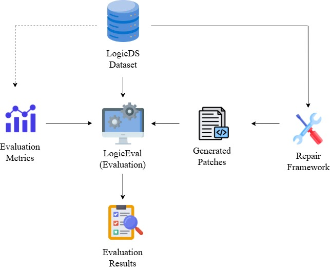

# LogicEval

Dataset, Patches, and Code for the paper
*LogicEval: A Systematic Framework for Evaluating Automated Repair Techniques for Logical Vulnerabilities in Real-World Software.* (ACL 2026)

This Repository Contains The Following Contents.

[`LogicDS/`](LogicDS/) **dataset** contains 122 samples (61 real-world + 61 synthetic) collected mostly from existing real-world CVEs to reflect the real-world complexity of logical vulnerabilities with security impact. The dataset is authored in a format designed for easy extension; see [`LogicDS/README.md`](LogicDS/README.md) for the per-sample structure and step-by-step instructions for adding a new sample, and [`LogicDS/SAMPLES.md`](LogicDS/SAMPLES.md) for the upstream-project inventory and sample-to-CVE mapping.

[`Patches/`](Patches/) contains the **patches** generated by three off-the-shelf LLMs (`Meta-Llama-3.1-70B-Instruct`, `Qwen2.5-Coder-32B-Instruct`, `openai-o3-mini`) for each sample, plus auxiliary patches from the [SimFix](https://github.com/xgdsmileboy/simfix), [KNOD](https://github.com/lin-tan/knod), and [VRPilot](https://arxiv.org/abs/2405.15690) baselines.

[`Codes/`](Codes/) holds the **framework code** — Python scripts that implement the LogicEval repair framework end-to-end: generate per-sample metadata from manual annotation inputs, generate the prompt templates described in the paper, call LLMs to obtain responses, graft responses into patches, and evaluate patches. Detailed step-by-step instructions are in [`Codes/README.md`](Codes/README.md).

## Workflow

The LogicEval workflow is summarised below — from authoring a new sample in LogicDS, through prompt generation and LLM patching, to NLP and compile-test evaluation:



## Additional working directories

| Folder | Role |
|---|---|
| `LLM_experiments/` | Pipeline working directory for the Codes scripts — holds `prompts/`, `responses/`, `patches/`, and `evaluation/` subtrees produced by scripts 02–06. Safe to regenerate entirely from `LogicDS/` + `Codes/`. |
| `api_config.json` | Template credentials file. Fill in `openai_key` and optionally `hf_token` before running LLM-backed scripts. |

## Quick start

```bash
cd LogicEval

# 1. Edit api_config.json — replace placeholders with your real keys
# 2. Regenerate code snippets for a sample (if you added one)
python3 Codes/01_generate_code_snippets.py --sample-filter sample_1 --kind real --overwrite

# 3. Build prompt templates
python3 Codes/02_generate_prompts.py --sample-filter sample_1 --kind real --overwrite

# 4. Call LLMs (openai is fastest, no GPU needed)
python3 Codes/03_generate_responses_openai.py --sample-filter sample_1 --kind real

# 5. Graft patches
python3 Codes/04_generate_patches.py --llm openai --sample-filter sample_1

# 6. Evaluate
python3 Codes/05_evaluate_nlp.py --sample-filter sample_1 --metrics rouge_l,patch_cosine_similarity
python3 Codes/06_evaluate_compile_test.py --sample-filter sample_1   # requires Docker
```

See `Codes/README.md` for every script's inputs, outputs, and CLI flags.

## Citation

If you find **LogicEval** or **LogicDS** useful in your research, please consider citing our paper:

```bibtex
@inproceedings{rashid-etal-2026-logiceval,
    title = {LogicEval: A Systematic Framework for Evaluating Automated Repair Techniques for Logical Vulnerabilities in Real-World Software},
    author = {Rashid, Syed Md Mukit and
              Ishtiaq, Abdullah Al and
              Tu, Kai and
              Dong, Yilu and
              Wu, Tianwei and
              Ranjbar, Ali and
              Yang, Tianchang and
              Sultana, Najrin and
              Mehnaz, Shagufta and
              Hussain, Syed Rafiul},
    booktitle = {Proceedings of the 64th Annual Meeting of the Association for Computational Linguistics (Volume 1: Long Papers)},
    year = {2026},
    pages = {46025--46049},
    publisher = {Association for Computational Linguistics},
    doi = {10.18653/v1/2026.acl-long.2136},
    url = {https://aclanthology.org/2026.acl-long.2136/}
}
```
